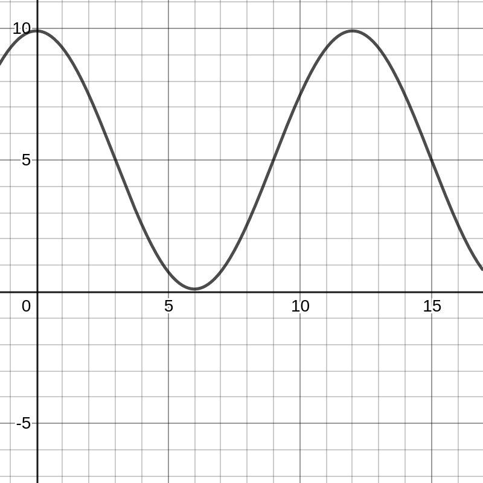

Em 10 de fevereiro de 1990, a maré alta em Boston era à meia-noite. O nível de água na maré alta era de 9,9 pés (em torno de 3m); mais tarde, na maré baixa, era de 0,1 pé (em torno de 3cm). Supondo que a próxima maré alta é exatamente ao meio-dia e que a altura da água é dada por uma função senoide (curva seno ou cosseno), encontre uma fórmula para o nível de água em Boston em função do tempo. Faça um esboço do gráfico da função.

```
a = mare_alta  = 9.9
b = mare_baixa = 0.1
m = meio_senoide = ((a-b)/2)

f(x) = m * cos(x * π/6) + (m + b)
```


